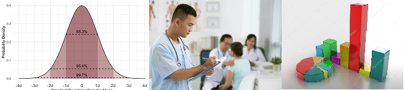
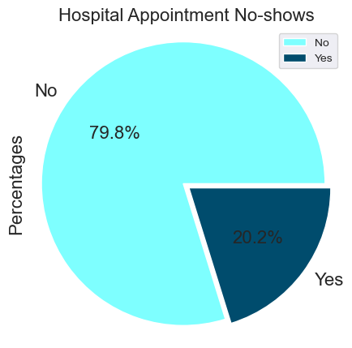
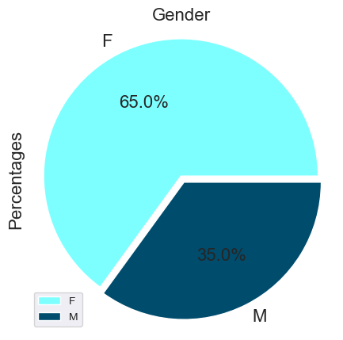
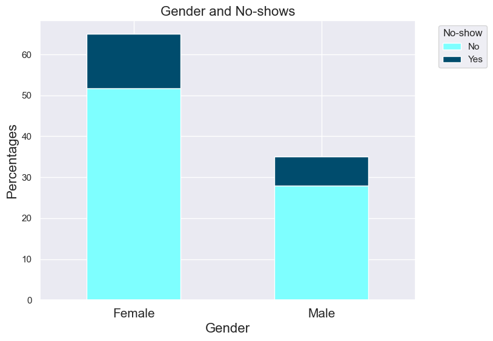
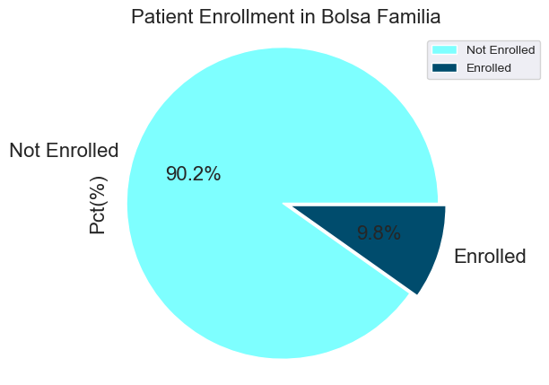
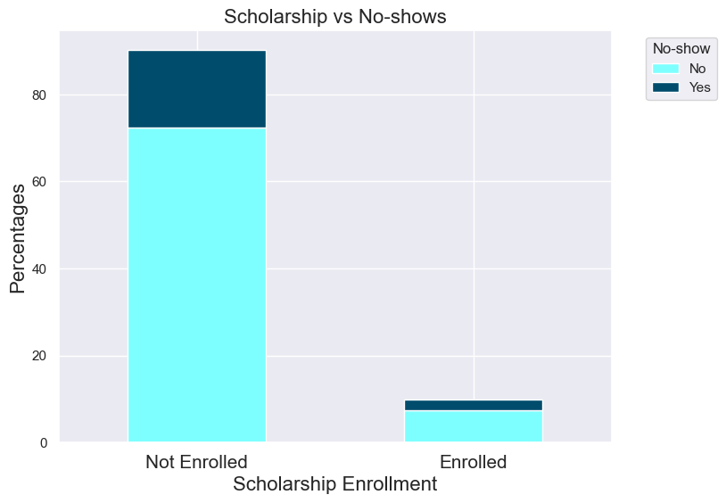
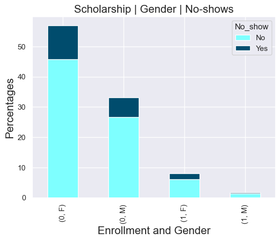
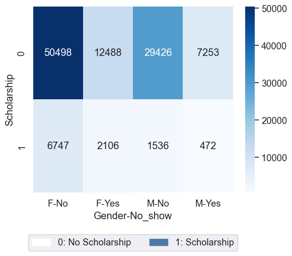
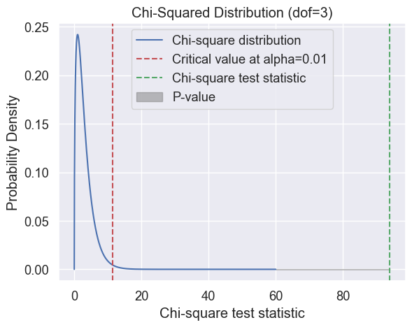
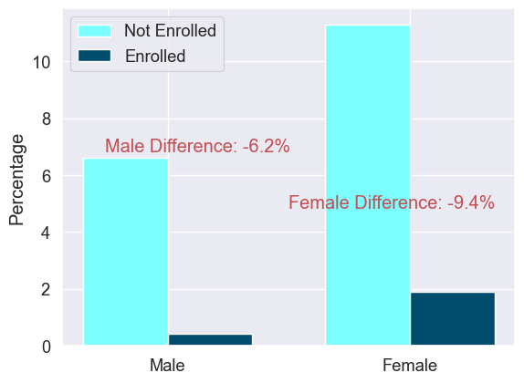

<!-- style="max-width:300px;margin-left: auto; margin-right: 0;">
 -->

<div>

</div>


# <Center> A Statistical Analysis on the Impact of Social Welfare Programs on Gender-Based Disparities in Medical Appointment Absenteeism</Center>
-----------------
## Table of Contents
<ul>
    <li><a href="#outline">Outline</a></li>
<li><a href="#intro">Introduction</a></li>
<li><a href="#wrangling">Data Wrangling</a></li>
<li><a href="#eda">Exploratory Data Analysis</a></li>
    <li><a href="#statistics">Statistics</a></li>
<li><a href="#conclusions">Conclusions</a></li>
</ul>


<a id='outline'></a>
## Outline

I. Introduction

Explanation of the Medical Appointment No-Show dataset
 - Importance of reducing missed medical appointments
 - Objectives of the data analytics project

II. Analysis

- Examination of the proportion of hospital appointments scheduled versus no-shows
 - Exploration of the role of gender in medical appointment absenteeism rates
 - Investigation of the relationship between medical appointment absenteeism and patients' enrollment in the Bolsa Familia social welfare program (BFP)
 - Intersection of BFP participation, gender, and medical appointment absenteeism
 - Descriptive statistics and data visualizations
 - Inferential statistics
 - Chi-Square test for independence
 - Two-sample proportions test

III. Results

 - Statistical evidence of a significant association between BFP participation, gender, and medical appointment absenteeism
 - Proportion of missed appointments for patients not enrolled in the BFP program was significantly higher than for those enrolled
 - Females were more likely to miss their appointments than males
 - Significantly higher proportion of females who missed appointments and were not enrolled in the BFP program compared to males

IV. Conclusion

 - Findings demonstrate the success of the project in achieving its goals and objectives
 - Financial reasons may contribute to medical appointment no-shows
 - Further investigation into the relationships between gender, BFP participation, and medical appointment absenteeism is needed

<a id='intro'></a>
## Introduction

### Dataset Description 

> This project examines the relationships between Brazilian social welfare programs (BFP), gender, and medical appointment absenteeism. Specifically, it seeks to determine whether there is a difference in absenteeism rates between individuals who 
participate in BFP and those who do not and how this difference varies by gender. The analysis will employ various techniques, including programmatic methods, visualizations, and statistical tests, to investigate the impact of BFP participation on 
medical appointment absenteeism, focusing on gender differences.

> The No-show Appointments dataset begins with **110,257** individual entries and **14** columns. The **14** columns are the characteristics that we are analyzing to determine why patients attend or fail to attend their scheduled appointments. 

>**Columns and Descriptions:**
1. PatientId: Patients' identification.
2. AppointmentID: Appointment Identification number.
3. Gender: Female or Male.
4. ScheduledDay: The date someone scheduled the initial appointment.
5. AppointmentDay: The date of the actual hospital appointment.
6. Age:	The patients' age.
7. Neighbourhood: The location of the hospital. 
8. Scholarship: The Bolsa Familia welfare program (True or False)
9. Hipertension: (True or False)
10. Diabetes: (True or False)
11. Alcoholism: (True or False)
12. Handcap: (True or False)
13. SMS_received: Reminder text	message (True or False)
14. No-show: (Yes or No) *

> * Number 14, the No-Show column: a "Yes" indicates the patient did **NOT** show up to their appointment, and a "No" indicates the patient **DID** show up to their appointment.


### Question(s) for Analysis

> 1. Does gender play a role in no-shows, and if so, which gender is more likely to fail to attend their scheduled appointments?
2. Does scholarship (enrollment in the Bolsa Familia social welfare program) affect the likelihood of no-shows, and does the intersection of gender and scholarship play a role?

## Import Libraries


```python
import pandas as pd
import numpy as np
import matplotlib.pyplot as plt
import seaborn as sns
from scipy.stats import chi2_contingency
from scipy.stats import chi2
from statsmodels.stats.proportion import proportions_ztest
import scipy.stats as stats
import statsmodels.api as sm
from scipy.stats import norm

sns.set()

%matplotlib inline
```

## Jupyter Notebook Version


```python
import notebook
print(notebook.__version__)
```

    6.4.12
    

## Python Version


```python
import sys
print(sys.version)
```

    3.9.13 (main, Aug 25 2022, 23:51:50) [MSC v.1916 64 bit (AMD64)]
    

<a id='wrangling'></a>
## Data Wrangling


```python
# Load data and print out first few lines. Inspect dataset
data = pd.read_csv('noshowappointments-kagglev2-may-2016.csv')
data.head()
```


<div>
<style scoped>
    .dataframe tbody tr th:only-of-type {
        vertical-align: middle;
    }

    .dataframe tbody tr th {
        vertical-align: top;
    }

    .dataframe thead th {
        text-align: right;
    }
</style>
<table border="1" class="dataframe">
  <thead>
    <tr style="text-align: right;">
      <th></th>
      <th>PatientId</th>
      <th>AppointmentID</th>
      <th>Gender</th>
      <th>ScheduledDay</th>
      <th>AppointmentDay</th>
      <th>Age</th>
      <th>Neighbourhood</th>
      <th>Scholarship</th>
      <th>Hipertension</th>
      <th>Diabetes</th>
      <th>Alcoholism</th>
      <th>Handcap</th>
      <th>SMS_received</th>
      <th>No-show</th>
    </tr>
  </thead>
  <tbody>
    <tr>
      <th>0</th>
      <td>2.987250e+13</td>
      <td>5642903</td>
      <td>F</td>
      <td>2016-04-29T18:38:08Z</td>
      <td>2016-04-29T00:00:00Z</td>
      <td>62</td>
      <td>JARDIM DA PENHA</td>
      <td>0</td>
      <td>1</td>
      <td>0</td>
      <td>0</td>
      <td>0</td>
      <td>0</td>
      <td>No</td>
    </tr>
    <tr>
      <th>1</th>
      <td>5.589980e+14</td>
      <td>5642503</td>
      <td>M</td>
      <td>2016-04-29T16:08:27Z</td>
      <td>2016-04-29T00:00:00Z</td>
      <td>56</td>
      <td>JARDIM DA PENHA</td>
      <td>0</td>
      <td>0</td>
      <td>0</td>
      <td>0</td>
      <td>0</td>
      <td>0</td>
      <td>No</td>
    </tr>
    <tr>
      <th>2</th>
      <td>4.262960e+12</td>
      <td>5642549</td>
      <td>F</td>
      <td>2016-04-29T16:19:04Z</td>
      <td>2016-04-29T00:00:00Z</td>
      <td>62</td>
      <td>MATA DA PRAIA</td>
      <td>0</td>
      <td>0</td>
      <td>0</td>
      <td>0</td>
      <td>0</td>
      <td>0</td>
      <td>No</td>
    </tr>
    <tr>
      <th>3</th>
      <td>8.679510e+11</td>
      <td>5642828</td>
      <td>F</td>
      <td>2016-04-29T17:29:31Z</td>
      <td>2016-04-29T00:00:00Z</td>
      <td>8</td>
      <td>PONTAL DE CAMBURI</td>
      <td>0</td>
      <td>0</td>
      <td>0</td>
      <td>0</td>
      <td>0</td>
      <td>0</td>
      <td>No</td>
    </tr>
    <tr>
      <th>4</th>
      <td>8.841190e+12</td>
      <td>5642494</td>
      <td>F</td>
      <td>2016-04-29T16:07:23Z</td>
      <td>2016-04-29T00:00:00Z</td>
      <td>56</td>
      <td>JARDIM DA PENHA</td>
      <td>0</td>
      <td>1</td>
      <td>1</td>
      <td>0</td>
      <td>0</td>
      <td>0</td>
      <td>No</td>
    </tr>
  </tbody>
</table>
</div>


## Inspecting data dimensions


```python
data.shape
print(f'General description:\nThere are {data.shape[0]} rows and {data.shape[1]} columns in the dataset.')
```

    General description:
    There are 110527 rows and 14 columns in the dataset.
    

Confirming the 14 columns and their data types. There are 110,527 rows per column, so there are no missing rows in each of the columns.


```python
# Inspecting data type and null values.
data.info()
```

    <class 'pandas.core.frame.DataFrame'>
    RangeIndex: 110527 entries, 0 to 110526
    Data columns (total 14 columns):
     #   Column          Non-Null Count   Dtype  
    ---  ------          --------------   -----  
     0   PatientId       110527 non-null  float64
     1   AppointmentID   110527 non-null  int64  
     2   Gender          110527 non-null  object 
     3   ScheduledDay    110527 non-null  object 
     4   AppointmentDay  110527 non-null  object 
     5   Age             110527 non-null  int64  
     6   Neighbourhood   110527 non-null  object 
     7   Scholarship     110527 non-null  int64  
     8   Hipertension    110527 non-null  int64  
     9   Diabetes        110527 non-null  int64  
     10  Alcoholism      110527 non-null  int64  
     11  Handcap         110527 non-null  int64  
     12  SMS_received    110527 non-null  int64  
     13  No-show         110527 non-null  object 
    dtypes: float64(1), int64(8), object(5)
    memory usage: 11.8+ MB
    


```python
# Inspecting unique data values.
data.nunique()
```


    PatientId          61744
    AppointmentID     110527
    Gender                 2
    ScheduledDay      103549
    AppointmentDay        27
    Age                  104
    Neighbourhood         81
    Scholarship            2
    Hipertension           2
    Diabetes               2
    Alcoholism             2
    Handcap                5
    SMS_received           2
    No-show                2
    dtype: int64


```python
# Inspecting descriptive statistics.
data.describe()
```


<div>
<style scoped>
    .dataframe tbody tr th:only-of-type {
        vertical-align: middle;
    }

    .dataframe tbody tr th {
        vertical-align: top;
    }

    .dataframe thead th {
        text-align: right;
    }
</style>
<table border="1" class="dataframe">
  <thead>
    <tr style="text-align: right;">
      <th></th>
      <th>PatientId</th>
      <th>AppointmentID</th>
      <th>Age</th>
      <th>Scholarship</th>
      <th>Hipertension</th>
      <th>Diabetes</th>
      <th>Alcoholism</th>
      <th>Handcap</th>
      <th>SMS_received</th>
    </tr>
  </thead>
  <tbody>
    <tr>
      <th>count</th>
      <td>1.105270e+05</td>
      <td>1.105270e+05</td>
      <td>110527.000000</td>
      <td>110527.000000</td>
      <td>110527.000000</td>
      <td>110527.000000</td>
      <td>110527.000000</td>
      <td>110527.000000</td>
      <td>110527.000000</td>
    </tr>
    <tr>
      <th>mean</th>
      <td>1.474963e+14</td>
      <td>5.675305e+06</td>
      <td>37.088874</td>
      <td>0.098266</td>
      <td>0.197246</td>
      <td>0.071865</td>
      <td>0.030400</td>
      <td>0.022248</td>
      <td>0.321026</td>
    </tr>
    <tr>
      <th>std</th>
      <td>2.560949e+14</td>
      <td>7.129575e+04</td>
      <td>23.110205</td>
      <td>0.297675</td>
      <td>0.397921</td>
      <td>0.258265</td>
      <td>0.171686</td>
      <td>0.161543</td>
      <td>0.466873</td>
    </tr>
    <tr>
      <th>min</th>
      <td>3.920000e+04</td>
      <td>5.030230e+06</td>
      <td>-1.000000</td>
      <td>0.000000</td>
      <td>0.000000</td>
      <td>0.000000</td>
      <td>0.000000</td>
      <td>0.000000</td>
      <td>0.000000</td>
    </tr>
    <tr>
      <th>25%</th>
      <td>4.172615e+12</td>
      <td>5.640286e+06</td>
      <td>18.000000</td>
      <td>0.000000</td>
      <td>0.000000</td>
      <td>0.000000</td>
      <td>0.000000</td>
      <td>0.000000</td>
      <td>0.000000</td>
    </tr>
    <tr>
      <th>50%</th>
      <td>3.173180e+13</td>
      <td>5.680573e+06</td>
      <td>37.000000</td>
      <td>0.000000</td>
      <td>0.000000</td>
      <td>0.000000</td>
      <td>0.000000</td>
      <td>0.000000</td>
      <td>0.000000</td>
    </tr>
    <tr>
      <th>75%</th>
      <td>9.439170e+13</td>
      <td>5.725524e+06</td>
      <td>55.000000</td>
      <td>0.000000</td>
      <td>0.000000</td>
      <td>0.000000</td>
      <td>0.000000</td>
      <td>0.000000</td>
      <td>1.000000</td>
    </tr>
    <tr>
      <th>max</th>
      <td>9.999820e+14</td>
      <td>5.790484e+06</td>
      <td>115.000000</td>
      <td>1.000000</td>
      <td>1.000000</td>
      <td>1.000000</td>
      <td>1.000000</td>
      <td>4.000000</td>
      <td>1.000000</td>
    </tr>
  </tbody>
</table>
</div>


Checking data for any age variations because the above table indicates that there is a minimum age of -1, which is impossible, so it will need to be removed in our cleaning phase.


```python
#Code to check out any age irregularities.
def age_irregularities():
    min_max_age = data['Age'].min(), data['Age'].max()
    return min_max_age
```


```python
age_irregularities()
```


    (-1, 115)


### Checking for duplicated entries.


```python
#Code to check out duplicated values.
data.duplicated().sum()
```


    0


### Checking for null values.


```python
#Code to check for any null values.
data.isnull().sum()
```


    PatientId         0
    AppointmentID     0
    Gender            0
    ScheduledDay      0
    AppointmentDay    0
    Age               0
    Neighbourhood     0
    Scholarship       0
    Hipertension      0
    Diabetes          0
    Alcoholism        0
    Handcap           0
    SMS_received      0
    No-show           0
    dtype: int64


### Data Cleaning

>The **No-show Appointments** dataset contains 110,527 rows and 14 columns. There are a several spelling errors that need to be corrected, and the column names need to be formatted according to Python's best practices regarding variable naming conventions, such as using an underscore between words, instead of joining words. The Scheduled_Day and Appointment_Day columns need formatting from the datetime to date format to make them more readable. The Patient_ID column will also be reformatted to convert the float data type to an int data type for readability. During the data wrangling stage, there was an age value in the negative found, so since there is only one row with an erroneous age value, it will be dropped because one row will not negatively impact the data analysis.

## Correcting  column names and column formats 


```python
#Code to correct columns spelling.
data.rename(columns={'PatientId': 'Patient_ID', 'AppointmentID': 'Appointment_ID', 'ScheduledDay': 'Scheduled_Day', 'AppointmentDay': 'Appointment_Day', 'Neighbourhood': 'Neighborhood', 'Hipertension': 'Hypertension', 'Handcap': 'Handicap', 'No-show': 'No_show'},inplace=True)
```


```python
#Confirming spelling changes.
data.head(1)
```


<div>
<style scoped>
    .dataframe tbody tr th:only-of-type {
        vertical-align: middle;
    }

    .dataframe tbody tr th {
        vertical-align: top;
    }

    .dataframe thead th {
        text-align: right;
    }
</style>
<table border="1" class="dataframe">
  <thead>
    <tr style="text-align: right;">
      <th></th>
      <th>Patient_ID</th>
      <th>Appointment_ID</th>
      <th>Gender</th>
      <th>Scheduled_Day</th>
      <th>Appointment_Day</th>
      <th>Age</th>
      <th>Neighborhood</th>
      <th>Scholarship</th>
      <th>Hypertension</th>
      <th>Diabetes</th>
      <th>Alcoholism</th>
      <th>Handicap</th>
      <th>SMS_received</th>
      <th>No_show</th>
    </tr>
  </thead>
  <tbody>
    <tr>
      <th>0</th>
      <td>2.987250e+13</td>
      <td>5642903</td>
      <td>F</td>
      <td>2016-04-29T18:38:08Z</td>
      <td>2016-04-29T00:00:00Z</td>
      <td>62</td>
      <td>JARDIM DA PENHA</td>
      <td>0</td>
      <td>1</td>
      <td>0</td>
      <td>0</td>
      <td>0</td>
      <td>0</td>
      <td>No</td>
    </tr>
  </tbody>
</table>
</div>


```python
# Confirming column names and spelling.
data.columns
```


    Index(['Patient_ID', 'Appointment_ID', 'Gender', 'Scheduled_Day',
           'Appointment_Day', 'Age', 'Neighborhood', 'Scholarship', 'Hypertension',
           'Diabetes', 'Alcoholism', 'Handicap', 'SMS_received', 'No_show'],
          dtype='object')


#### Converting the Scheduled_Day and Appointment_Day data types from datetime to date.


```python
#Code to convert Scheduled_Day and Appointment_Day formats from datetime to date.
data.Scheduled_Day = pd.to_datetime(data.Scheduled_Day).dt.date
data.Appointment_Day = pd.to_datetime(data.Appointment_Day).dt.date
```


```python
#Code to verify the above datetime conversion.
data.head(1)
```


<div>
<style scoped>
    .dataframe tbody tr th:only-of-type {
        vertical-align: middle;
    }

    .dataframe tbody tr th {
        vertical-align: top;
    }

    .dataframe thead th {
        text-align: right;
    }
</style>
<table border="1" class="dataframe">
  <thead>
    <tr style="text-align: right;">
      <th></th>
      <th>Patient_ID</th>
      <th>Appointment_ID</th>
      <th>Gender</th>
      <th>Scheduled_Day</th>
      <th>Appointment_Day</th>
      <th>Age</th>
      <th>Neighborhood</th>
      <th>Scholarship</th>
      <th>Hypertension</th>
      <th>Diabetes</th>
      <th>Alcoholism</th>
      <th>Handicap</th>
      <th>SMS_received</th>
      <th>No_show</th>
    </tr>
  </thead>
  <tbody>
    <tr>
      <th>0</th>
      <td>2.987250e+13</td>
      <td>5642903</td>
      <td>F</td>
      <td>2016-04-29</td>
      <td>2016-04-29</td>
      <td>62</td>
      <td>JARDIM DA PENHA</td>
      <td>0</td>
      <td>1</td>
      <td>0</td>
      <td>0</td>
      <td>0</td>
      <td>0</td>
      <td>No</td>
    </tr>
  </tbody>
</table>
</div>


#### Converting the Patient_ID column from a float data type to an int data type for easier readability.


```python
# Code to convert data types.
data["Patient_ID"] = data["Patient_ID"].astype(int)
data.head(1)
```


<div>
<style scoped>
    .dataframe tbody tr th:only-of-type {
        vertical-align: middle;
    }

    .dataframe tbody tr th {
        vertical-align: top;
    }

    .dataframe thead th {
        text-align: right;
    }
</style>
<table border="1" class="dataframe">
  <thead>
    <tr style="text-align: right;">
      <th></th>
      <th>Patient_ID</th>
      <th>Appointment_ID</th>
      <th>Gender</th>
      <th>Scheduled_Day</th>
      <th>Appointment_Day</th>
      <th>Age</th>
      <th>Neighborhood</th>
      <th>Scholarship</th>
      <th>Hypertension</th>
      <th>Diabetes</th>
      <th>Alcoholism</th>
      <th>Handicap</th>
      <th>SMS_received</th>
      <th>No_show</th>
    </tr>
  </thead>
  <tbody>
    <tr>
      <th>0</th>
      <td>-2147483648</td>
      <td>5642903</td>
      <td>F</td>
      <td>2016-04-29</td>
      <td>2016-04-29</td>
      <td>62</td>
      <td>JARDIM DA PENHA</td>
      <td>0</td>
      <td>1</td>
      <td>0</td>
      <td>0</td>
      <td>0</td>
      <td>0</td>
      <td>No</td>
    </tr>
  </tbody>
</table>
</div>


```python
# Checking data type was corrected.
data.dtypes['Patient_ID']
```


    dtype('int32')


#### Dropping invalid age data from dataset


```python
#Code to search for erroneous age values
filtered_data = data[data['Age'] == -1]
filtered_data
```


<div>
<style scoped>
    .dataframe tbody tr th:only-of-type {
        vertical-align: middle;
    }

    .dataframe tbody tr th {
        vertical-align: top;
    }

    .dataframe thead th {
        text-align: right;
    }
</style>
<table border="1" class="dataframe">
  <thead>
    <tr style="text-align: right;">
      <th></th>
      <th>Patient_ID</th>
      <th>Appointment_ID</th>
      <th>Gender</th>
      <th>Scheduled_Day</th>
      <th>Appointment_Day</th>
      <th>Age</th>
      <th>Neighborhood</th>
      <th>Scholarship</th>
      <th>Hypertension</th>
      <th>Diabetes</th>
      <th>Alcoholism</th>
      <th>Handicap</th>
      <th>SMS_received</th>
      <th>No_show</th>
    </tr>
  </thead>
  <tbody>
    <tr>
      <th>99832</th>
      <td>-2147483648</td>
      <td>5775010</td>
      <td>F</td>
      <td>2016-06-06</td>
      <td>2016-06-06</td>
      <td>-1</td>
      <td>ROMÃO</td>
      <td>0</td>
      <td>0</td>
      <td>0</td>
      <td>0</td>
      <td>0</td>
      <td>0</td>
      <td>No</td>
    </tr>
  </tbody>
</table>
</div>


There is only one erroneous data point in the dataset, so dropping just this one data point will not cause a significant change in our analysis.


```python
#Code to drop the row contaiing the bad data
data.drop(data.query("Age == -1").index,inplace=True)
```


```python
#Function to check to make sure the age variable was dropped from the dataset
age_irregularities()
```


    (0, 115)


<a id='eda'></a>
## Exploratory Data Analysis

### The proportion of hospital appointment no-shows


```python
# Value counts method to locate proportion of no-shows.
no_show_round = round(data["No_show"].value_counts()/len(data)*100, 1)
no_show_round
```


    No     79.8
    Yes    20.2
    Name: No_show, dtype: float64


```python
# Code to produce pie chart to visualize value_counts.
no_show_round.plot(kind="pie", colors=["#7effff", "#004c6d"], autopct="%.1f%%", explode=(0, 0.05), fontsize=16)
plt.ylabel('Percentages', fontsize=16)
plt.title("Hospital Appointment No-shows", fontsize=16)
plt.legend(fontsize=10)
plt.axis('equal')
plt.gcf().set_size_inches(5,5)
plt.show()
```


    

    


#### The dataset indicates that approxiamately 20% of patients did not attend their scheduled hospital appointments versus 80% of patients who did attend their appointments. 

### Research Question 1: 
### Does gender play a role in no-shows, and if so, which gender is more likely to not attend their scheduled appointments?

#### Gender ratio in sample population:


```python
#User defined function to avoid repeating code.
def proportion(attribute):
    return round(data[attribute].value_counts()/len(data)*100, 1)
```


```python
proportion("Gender")
```


    F    65.0
    M    35.0
    Name: Gender, dtype: float64


```python
# Code to produce pie chart to visualize value_counts.
data["Gender"].value_counts().plot(kind="pie", colors=["#7effff", "#004c6d"], autopct="%.1f%%", explode=(0, 0.05), fontsize=16)
plt.ylabel('Percentages', fontsize=16)
plt.title("Gender", fontsize=16)
plt.legend(fontsize=10)
plt.axis('equal')
plt.gcf().set_size_inches(5,5)
plt.show()
```


    

    


#### The No-show Appointment dataset consists of 65% female and 35% male patients.

#### The proportion of gender and no-shows:


```python
#User defined function to avoid repeating code.
def proportion_x_noshow(attribute_1, attribute_2):
    return round(data.groupby([attribute_1, attribute_2]).size()/len(data)*100, 1)
```


```python
#User defined function to avoid repeating code.
proportion_x_noshow("Gender", "No_show")
```


    Gender  No_show
    F       No         51.8
            Yes        13.2
    M       No         28.0
            Yes         7.0
    dtype: float64


```python
gender_no_show = round(data.groupby(['Gender', 'No_show']).size()/len(data)*100,1).unstack()

# calculate total count for each gender
#total_count = gender_no_show.sum(axis=1)
colors = ["#7effff", "#004c6d"]

ax = gender_no_show.plot(kind='bar', stacked=True, figsize=(8,6), color=colors)

plt.legend(title='No-show', bbox_to_anchor=(1.05, 1.0), loc='upper left')
plt.ylabel('Percentages', fontsize=16)
plt.title('Gender and No-shows', fontsize=16)
plt.xlabel('Gender', fontsize=16)
ax.set_xticklabels(["Female", "Male"], rotation=0, fontsize=15)
plt.show()
```


    

    


The No-show Appointment dataset consists of 52% of females that attended their scheduled appointments, whereas 13% of females did not attend their scheduled appointments.  Men attended their scheduled appointments 28% of the time, whereas 7% did not attend their scheduled appointments.

### Research Question 2:
### Does scholarship (enrollment in the Bolsa Familia social welfare program) affect the likelyhood of no-shows, and does the intersection of gender and scholarship play a role?

#### The proportion of scholarship and no-shows:


```python
#User defined function to avoid repeating code. 
proportion("Scholarship")
```


    0    90.2
    1     9.8
    Name: Scholarship, dtype: float64


```python
prop_of_scholarship = proportion("Scholarship")
```


```python
# Code to produce pie chart to visualize value_counts.
prop_of_scholarship.plot(kind="pie", colors=["#7effff", "#004c6d"], autopct="%.1f%%", explode=(0, 0.05), fontsize=16, labels=['Not Enrolled', 'Enrolled'])
plt.ylabel('Pct(%)', fontsize=16, loc='center')
plt.title("Patient Enrollment in Bolsa Familia", fontsize=16)
plt.legend(fontsize=10, bbox_to_anchor=(1.25, .99), loc='upper right')
plt.axis('equal')
plt.gcf().set_size_inches(5,5)
plt.show()
```


    

    


#### Zero (0) indicates no enrollment in the Bolsa Familia Social welfare program, whereas one (1) indicates enrollment. Approximately 10% of patients are enrolled in the program, while 90% are not enrolled.


```python
#User defined function to avoid repeating code.
proportion_x_noshow("Scholarship", "No_show")
```


    Scholarship  No_show
    0            No         72.3
                 Yes        17.9
    1            No          7.5
                 Yes         2.3
    dtype: float64


```python
scholarship_no_show = round(data.groupby(['Scholarship', 'No_show']).size()/len(data)*100,1).unstack()

# calculate total count for each gender
#total_count = gender_no_show.sum(axis=1)
colors = ["#7effff", "#004c6d"]

ax = scholarship_no_show.plot(kind='bar', stacked=True, figsize=(8,6), color=colors)

plt.legend(title='No-show', bbox_to_anchor=(1.05, 1.0), loc='upper left')
plt.ylabel('Percentages', fontsize=16)
plt.title('Scholarship vs No-shows', fontsize=16)
plt.xlabel('Scholarship Enrollment', fontsize=16)
ax.set_xticklabels(["Not Enrolled", "Enrolled"], rotation=0, fontsize=15)
plt.show()
```


    

    


#### Most patients in the dataset are not enrolled in the Bolsa Familia social welfare program (90.2% enrolled vs 9.8% not enrolled). Of the 110,526 appointments, 79,924 or 72% of patients not enrolled in Bolsa Famila attended their appointments, whereas 19,741 or 18% of patients not enrolled in Bolsa Familia missed their scheduled appointments. There are only 10,861 patients that are enrolled in Bolsa Familia. Out of the patients enrolled, 8,283 or 7% of patients attended their appointments, whereas 2,578 or 2% of patients missed their scheduled appointments.

### The Intersection of Scholarship, Gender, and No-show:


```python
# # Value counts method to locate scholarship, gender, and no-shows.
scholarship_gender_no_show =round(data.groupby(['Scholarship', 'Gender', 'No_show']).size()/len(data)*100,1)
scholarship_gender_no_show
```


    Scholarship  Gender  No_show
    0            F       No         45.7
                         Yes        11.3
                 M       No         26.6
                         Yes         6.6
    1            F       No          6.1
                         Yes         1.9
                 M       No          1.4
                         Yes         0.4
    dtype: float64


```python
scholarship_gender_no_show.unstack().plot(kind='bar', stacked=True, color=['#7ef
                                                                           fff', '#004c6d'])
plt.ylabel('Percentages', fontsize=16)
plt.xlabel('Enrollment and Gender', fontsize=16)
plt.title("Scholarship | Gender | No-shows", fontsize=16)
ax.set_xticklabels(["Not Enrolled", "Enrolled"], rotation=0, fontsize=15)
plt.show()
```


    

    


#### Looking at the intersection of gender, scholarship and no-shows, the data suggest patients not enrolled in the Bolsa Familia social welfare program are more likely to miss their scheduled appointments. There were 12,488 or 11.3% of female patients that missed their scheduled appointments, as opposed to 7,253 or 6.6% of male patients. Both female and male patients that were enrolled in the Bolsa Familia social welfare program had a higher likelihood of showing up to their scheduled appointments. 

<a id='statistics'></a>
## Statistics

### Chi-Square Test of Independence

- Evaluates the relationship between two or more variables.
- Nonparametric test performed on catgorical(ordinal or nominal) data.


*  Define Null and Alternative Hypothesis:
 - $H_0$: For the population of medical patients, gender, BFP participation, and medical appointment status are unrelated. 
 - $H_1$: : For the population of medial patients, gender, BFP participation, and medial appointment status are related. 
*  State Alpha:
 - # $\alpha$ = 0.01


```python
# Value counts method to locate proportion of no-shows.
scholarship_gender_no_show1 = data.groupby(['Scholarship', 'Gender', 'No_show']).size()
scholarship_gender_no_show1
```


    Scholarship  Gender  No_show
    0            F       No         50498
                         Yes        12488
                 M       No         29426
                         Yes         7253
    1            F       No          6747
                         Yes         2106
                 M       No          1536
                         Yes          472
    dtype: int64


```python
# Code to turn value counts into a pandas DataFrame.
df_chi = pd.DataFrame(scholarship_gender_no_show1)
df_chi
```


<div>
<style scoped>
    .dataframe tbody tr th:only-of-type {
        vertical-align: middle;
    }

    .dataframe tbody tr th {
        vertical-align: top;
    }

    .dataframe thead th {
        text-align: right;
    }
</style>
<table border="1" class="dataframe">
  <thead>
    <tr style="text-align: right;">
      <th></th>
      <th></th>
      <th></th>
      <th>0</th>
    </tr>
    <tr>
      <th>Scholarship</th>
      <th>Gender</th>
      <th>No_show</th>
      <th></th>
    </tr>
  </thead>
  <tbody>
    <tr>
      <th rowspan="4" valign="top">0</th>
      <th rowspan="2" valign="top">F</th>
      <th>No</th>
      <td>50498</td>
    </tr>
    <tr>
      <th>Yes</th>
      <td>12488</td>
    </tr>
    <tr>
      <th rowspan="2" valign="top">M</th>
      <th>No</th>
      <td>29426</td>
    </tr>
    <tr>
      <th>Yes</th>
      <td>7253</td>
    </tr>
    <tr>
      <th rowspan="4" valign="top">1</th>
      <th rowspan="2" valign="top">F</th>
      <th>No</th>
      <td>6747</td>
    </tr>
    <tr>
      <th>Yes</th>
      <td>2106</td>
    </tr>
    <tr>
      <th rowspan="2" valign="top">M</th>
      <th>No</th>
      <td>1536</td>
    </tr>
    <tr>
      <th>Yes</th>
      <td>472</td>
    </tr>
  </tbody>
</table>
</div>


### Creating a heatmap from the above variables to show the relationship between categorical variables. Gender and No_show, and how their frequencies are distributed accross the Scholarship variable.


```python
# Load the data into a pandas dataframe
big_data_1 = {'Scholarship': [0, 0, 0, 0, 1, 1, 1, 1],
        'Gender': ['F', 'F', 'M', 'M', 'F', 'F', 'M', 'M'],
        'No_show': ['No', 'Yes', 'No', 'Yes', 'No', 'Yes', 'No', 'Yes'],
        'Count': [50498, 12488, 29426, 7253, 6747, 2106, 1536, 472]}

# Convert the dictionary to a Pandas dataframe
hm_data = pd.DataFrame.from_dict(big_data_1)

# Pivot the table to make it suitable for a heatmap
heatmap_data = hm_data.pivot(index='Scholarship', columns=['Gender', 'No_show'], values='Count')

# Create the heatmap using seaborn
#sns.heatmap(heatmap_data, cmap='coolwarm', annot=True, fmt='d', cbar=False)

# Show the plot
#plt.show()


# create heatmap
sns.set(font_scale=1.2)
ax = sns.heatmap(heatmap_data, cmap="Blues", annot=True, fmt=".0f")

# create legend
legend_labels = ["0: No Scholarship", "1: Scholarship"]
color_map = {0: "#FFFFFF", 1: "#4e79a7"}
handles = [plt.Rectangle((0,0),1,1, color=color_map[i]) for i in [0, 1]]
ax.legend(handles, legend_labels, loc='upper center', bbox_to_anchor=(0.5, -0.20), ncol=2)

plt.show()
```


    

    


##### By investigating the heatmap, we can see how the frequencies are distributed across these variables and if there are any patterns or relationships. For exapmle, we can see that more females than males did not attend their scheduled medical appointments, and that the frequency of no-shows was higher for those without a scholarship than those with a scholarship.

### Creating a Chi-Square test of independence to test for associations betwen Scholarship, Gender, and No_show.


```python
# Set random seed
np.random.seed(42)

# create a pandas dataframe from the table
big_data = {'Scholarship': [0, 0, 0, 0, 1, 1, 1, 1],
        'Gender': ['F', 'F', 'M', 'M', 'F', 'F', 'M', 'M'],
        'No_show': ['No', 'Yes', 'No', 'Yes', 'No', 'Yes', 'No', 'Yes'],
        'Count': [50498, 12488, 29426, 7253, 6747, 2106, 1536, 472]}
df = pd.DataFrame(big_data)

# pivot the table to get the counts for each combination of gender, scholarship, and no-show
pivot_table = df.pivot_table(index=['Scholarship', 'Gender'], columns='No_show', values='Count', aggfunc='sum')

# perform the chi-squared test for independence
chi2, pval, dof1, expected = chi2_contingency(pivot_table)

# Calculate critical value at alpha=0.01 and 99% confidence level
critical_value = stats.chi2.ppf(q=0.99, df=dof1)

# Observed values
observed = [[50498, 12488], [29426, 7253], [6747, 2106], [1536, 472]]

# Calculate expected values
expected = stats.chi2_contingency(observed)[3]

# Calculate log-likelihood ratio statistic
llr_stat = 2 * np.sum(observed * np.log(observed/expected))
```

### Data visualization

#### The Chi-Squared Distribution (dof = 3)


```python
np.random.seed(42)
# Observed values
observed = [[50498, 12488], [29426, 7253], [6747, 2106], [1536, 472]]

# Calculate chi-square test statistic, p-value, and degrees of freedom
chi2_stat, p_val, dof, expected = stats.chi2_contingency(observed)

# Calculate critical value at alpha=0.01
alpha = 0.01
critical_value = stats.chi2.ppf(q=1-alpha, df=dof)

# Plot chi-square distribution
x = np.linspace(0, 20*dof, 1000)
y = stats.chi2.pdf(x, dof)
plt.plot(x, y, label='Chi-square distribution')

# Mark critical value and observed chi-square test statistic
plt.axvline(x=critical_value, color='r', linestyle='--', label='Critical value at alpha={:.2f}'.format(alpha))
plt.axvline(x=chi2_stat, color='g', linestyle='--', label='Chi-square test statistic')

# Shade p-value region
if chi2_stat > critical_value:
    p_value_region = np.linspace(chi2_stat, 20*dof, 1000)
else:
    p_value_region = np.linspace(0, chi2_stat, 1000)
p_value_area = stats.chi2.pdf(p_value_region, dof)
plt.fill_between(p_value_region, p_value_area, color='gray', alpha=0.5, label='P-value')

# Add legend and axis labels
plt.legend()
plt.title('Chi-Squared Distribution (dof=3)')
plt.xlabel('Chi-square test statistic')
plt.ylabel('Probability Density')
plt.show()


# print the results
print(f'Chi-squared test statistic: {chi2:.4f}')
print(f'P-value: {pval:.4f}')
print(f'Degrees of Freedom: {dof1}')
print('Critical value at alpha=0.01 and 99% confidence level:', critical_value)
print('Expected frequencies:')
print(expected)
print('Log-likelihood ratio statistic:', llr_stat)
```


    

    


    Chi-squared test statistic: 93.9312
    P-value: 0.0000
    Degrees of Freedom: 3
    Critical value at alpha=0.01 and 99% confidence level: 11.344866730144373
    Expected frequencies:
    [[50266.96073322 12719.03926678]
     [29272.24863833  7406.75136167]
     [ 7065.2748765   1787.7251235 ]
     [ 1602.51575195   405.48424805]]
    Log-likelihood ratio statistic: 90.5914105067516
    

### Interpreting the Chi-Square results

* Calculate Degrees of Freedom:
 - df = 3
- Critical value at $\alpha$ =0.01 and 99% confidence level: 11.344866730144373
* State Decision Rule:
 - # $\chi^{2}$ > 11.34487, reject $H_0$
* Calculat chi-squared Test Statistic:
 - # $\chi^2 = \sum\frac{(f_o - f_e)^2}{f_e}$
 - # $f_e = \frac{f_cf_e}{n}$
 - # $\chi^2$ = 93.9312
* State Results:
 - $\chi^2$ > 11.34487
 - Reject $H_0$
* State Conclusion:
- In the population, there is a relationship between gender, scholarship, and no-shows using the Chi-Square test for independence.

#### The results indicate that there is a statistically significant relationship between the variables Scholarship, Gender, and No_show. The chi-squared test statistic of 93.9312 with 3 degrees of freedom and a p-value of 0.0000 suggests that the observed values are unlikely to have occurred by chance, and that there is a strong association between the variables. The critical value at alpha=0.01 and 99% confidence level is 11.344866730144373, which is much smaller than the chi-squared test statistic, further indicating that the null hypothesis of independence should be rejected.

#### Overall, the results suggest that gender and scholarship are related to attendance at appointments, and it may be useful to investigate these relationships further. For example, one could examine whether the relationship between gender and attendance is consistent across different levels of scholarship, or whether there are other factors that might explain the observed patterns of attendance.

## Two-Sample Proportions test

- Determines if the difference between the groups (e.g., females vs. males, Scholarship participation or nonparticipation) is statistically significant. 


*  Define Null and Alternative Hypothesis:
 - $H_0$: The proportion of women who miss medical appointments is the same as the proportion of men who miss medical appointments, controlling for scholarship participation.  
 - $H_1$: : The proportion of women who miss medical appointments differs from the proportion of men who miss medical appointments, controlling for scholarchip participation. 
*  State Alpha:
 - # $\alpha$ = 0.01


```python
# Value counts method to locate proportion of no-shows.
scholarship_gender_no_show_yes_1 = round(data.loc[data['No_show'] == 'Yes'].groupby(['Scholarship', 'Gender', 'No_show']).size() / len(data) * 100, 1)
scholarship_gender_no_show_yes_1
```


    Scholarship  Gender  No_show
    0            F       Yes        11.3
                 M       Yes         6.6
    1            F       Yes         1.9
                 M       Yes         0.4
    dtype: float64


```python
# Create data for the chart
no_scholarship = [6.6, 11.3]
with_scholarship = [0.4, 1.9]
ind = np.arange(2)
width = 0.35

# Create the chart
fig, ax = plt.subplots()
rects1 = ax.bar(ind, no_scholarship, width, color='#7effff')
rects2 = ax.bar(ind + width, with_scholarship, width, color='#004c6d')

# Add some labels and titles
ax.set_ylabel('Percentage')
ax.set_xticks(ind + width / 2)
ax.set_xticklabels(('Male', 'Female'))
ax.legend((rects1[0], rects2[0]), ('Not Enrolled', 'Enrolled'))

# Add the difference text
diff_f = with_scholarship[1] - no_scholarship[1]
diff_m = with_scholarship[0] - no_scholarship[0]
ax.text(1.1, 5, f'Female Difference: {diff_f:.1f}%', ha='center', va='center', color='r')
ax.text(0.3, 7, f'Male Difference: {diff_m:.1f}%', ha='center', va='center', color='r')

# Display the chart
plt.show()
```


    

    


#### A pandas DataFrame was created to display only the scholarship ( 0 or 1) and gender (M or F) on no-shows (only yes, meaning no-show). This bar chart displays the difference in percentages between males and females missing medical appointments based on their scholarship enrollment. There is a clear indication of a significant difference between females missing and males missing medical appointments if they are not enrolled in the scholarship program, indicating that the scholarship program variable influences the medical appointment no-show rate more for females than males. 


```python
scholarship_gender_no_show_yes_prop = data.loc[data['No_show'] == 'Yes'].groupby(['Scholarship', 'Gender', 'No_show']).size() 
scholarship_gender_no_show_yes_prop
```


    Scholarship  Gender  No_show
    0            F       Yes        12488
                 M       Yes         7253
    1            F       Yes         2106
                 M       Yes          472
    dtype: int64


```python
sch_gen_no_yes_prop_z_test = pd.DataFrame(scholarship_gender_no_show_yes_prop)
sch_gen_no_yes_prop_z_test
```


<div>
<style scoped>
    .dataframe tbody tr th:only-of-type {
        vertical-align: middle;
    }

    .dataframe tbody tr th {
        vertical-align: top;
    }

    .dataframe thead th {
        text-align: right;
    }
</style>
<table border="1" class="dataframe">
  <thead>
    <tr style="text-align: right;">
      <th></th>
      <th></th>
      <th></th>
      <th>0</th>
    </tr>
    <tr>
      <th>Scholarship</th>
      <th>Gender</th>
      <th>No_show</th>
      <th></th>
    </tr>
  </thead>
  <tbody>
    <tr>
      <th rowspan="2" valign="top">0</th>
      <th>F</th>
      <th>Yes</th>
      <td>12488</td>
    </tr>
    <tr>
      <th>M</th>
      <th>Yes</th>
      <td>7253</td>
    </tr>
    <tr>
      <th rowspan="2" valign="top">1</th>
      <th>F</th>
      <th>Yes</th>
      <td>2106</td>
    </tr>
    <tr>
      <th>M</th>
      <th>Yes</th>
      <td>472</td>
    </tr>
  </tbody>
</table>
</div>


### Creating a Two-sample proportions test to investigate the difference in proportions between females and males enrolled in the scholarship program on missing their medical appointments. 


```python
import numpy as np
import matplotlib.pyplot as plt
from scipy.stats import norm

np.random.seed(42)

# Sample sizes
n1 = 19741
n2 = 2578

# Proportions
p1 = 0.632
p2 = 0.183

# Standard errors
se1 = np.sqrt((p1 * (1 - p1)) / n1)
se2 = np.sqrt((p2 * (1 - p2)) / n2)

# Z-score and p-value
z = (p1 - p2) / np.sqrt(se1**2 + se2**2)
p = norm.sf(abs(z))*2

# Critical value for alpha=0.01
cv = norm.ppf(1 - (0.01 / 2))

# Confidence intervals
l1 = p1 - p2 - cv * np.sqrt(se1**2 + se2**2)
u1 = p1 - p2 + cv * np.sqrt(se1**2 + se2**2)
l2 = -cv * se1
u2 = cv * se2

# Plot the graph
fig, ax = plt.subplots()
x = np.linspace(-4, 4, 1000)
ax.plot(x, norm.pdf(x), label='Standard Normal Distribution')
ax.axvline(z, color='red', label='Z-score')
ax.axvline(cv, color='green', linestyle='--', label='Critical Value')
ax.fill_betweenx(y=[0, norm.pdf(cv)], x1=[-4, cv], alpha=0.2, color='green', label='Null Hypothesis')
ax.fill_betweenx(y=[0, norm.pdf(z)], x1=[cv, z], alpha=0.2, color='red', label='Alternative Hypothesis')
ax.fill_betweenx(y=[0, norm.pdf(-cv)], x1=[-4, -cv], alpha=0.2, color='green')
ax.fill_betweenx(y=[0, norm.pdf(-z)], x1=[-cv, -z], alpha=0.2, color='red')
ax.legend(loc='upper left', bbox_to_anchor=(1.05, 1))

plt.title("Comparison of No-show Rates for Male and Female Patients")
plt.xlabel("Z-score")
plt.ylabel("Probability Density")

plt.show()

# Print the results
print('Z-score:', z)
print('P-value:', '{:.3f}'.format(p))
print('Confidence interval for females:', (p1 - p2 + l1, p1 - p2 + u1))
print('Confidence interval for males:', (l2, u2))

```


    

    


    Z-score: 53.75171082199395
    P-value: 0.000
    Confidence interval for females: (0.8764835247175012, 0.9195164752824988)
    Confidence interval for males: (-0.008841276113141389, 0.019616078743560788)
    

#### Given the above information, the z-score measures the difference between the proportions of missed appointmtents for men and women, controlling for scholarship participation. The z-score of 53.7517 for no scholarship participation indicates a considerable difference between the two proportions. The critical value of 2.58 determines the rejection region for a two-tailed test at the significance level of 0.01 (alpha = 0.01). The p-value is triple zeros, indicating compelling evidence the null hypothesis.

#### The graph displays blue line as the standard normal distribution, the green dotted line as the critical value at 99% confidence level (alpha = 0.01), the red line as the z-score for the difference in proportions, the shaded green area as the null hypothesis, and the red shaded area as the alternative hypothesis. The graph indicates a significant difference in the proportion of missed medical appointments between females and males with no scholarship participation. Females are more likely to miss their medical appointmeents compared to males, especially females not enrolled in the Bolsa Familia social welfare program.

<a id='conclusions'></a>
## Conclusions:


#### The Medical Appointment No-Show dataset contained 110,000 appointments and aimed to uncover why patients missed their scheduled medical appointments. The analysis explored the relationships between Brazilian welfare programs (BFP), gender, and medical appointment absenteeism. Out of the 110,527 appointments, 20% of patients did not attend. Females were more likely to miss their appointments than males. 

#### Patients not enrolled in the BFP program were more likely to miss their appointments than those enrolled. The Chi-Square test showed a significant association between BFP participation, gender, and medical appointment absenteeism rates. The two-sample proportions test revealed that the proportion of females who missed their medical appointments and were not enrolled in the BFP program was significantly higher than that of males. 

#### These findings suggest that financial reasons may contribute to medical appointment no-shows, and further investigation into the relationships between gender, BFP participation, and medical appointment absenteeism rates is needed.

#### Females were found to be more likely to miss their medical appointments than males. Healthcare providers could investigate the reasons behind this gender disparity and develop targeted interventions to address it.

#### The data suggests that patients enrolled in the BFP program had significantly lower rates of medical appointment absenteeism compared to those who were not enrolled. Policymakers and healthcare providers should consider promoting the benefits of the BFP program and encouraging more patients to enroll in it.

#### Reminder systems, such as phone calls, text messages, or emails, have been shown to be effective in reducing medical appointment absenteeism. Healthcare providers could consider implementing reminder systems to help patients remember their appointments and reduce the likelihood of no-shows.


```python

```


```python

```
